# Comprehensive Architecture & Technology Guide

A deep dive into LLM inference engines, transformer architectures, and the evolution from GPT-2 to GPT-5.

## Table of Contents

1. [Project Architecture](#project-architecture)
2. [Core Components](#core-components)
3. [Transformer Architecture](#transformer-architecture)
4. [GPT Evolution (GPT-2 to GPT-5)](#gpt-evolution)
5. [Inference Pipeline](#inference-pipeline)
6. [Memory Management](#memory-management)
7. [Technologies & Algorithms](#technologies--algorithms)
8. [Further Reading](#further-reading)

---

## Project Architecture

### High-Level System Overview


### Component Hierarchy


---

## Core Components

### 1. LLM (User-Facing API)

**Purpose**: High-level interface for text generation

**Key Responsibilities**:
- Tokenize input text
- Create generation requests
- Manage generation loop
- Detokenize output

**File**: `nanovllm/llm.go`

```go
// Simplified structure
type LLM struct {
    engine    *LLMEngine
    tokenizer Tokenizer
    config    *Config
}

func (llm *LLM) Generate(prompts []string, params *SamplingParams) []Output
```

**Learn More**:
- [Language Model API Design](https://huggingface.co/docs/transformers/main_classes/text_generation)

---

### 2. LLM Engine

**Purpose**: Core orchestration of inference process

**Key Responsibilities**:
- Coordinate scheduler, block manager, and model runner
- Execute prefill and decode phases
- Handle sequence lifecycle (add, abort, finish)
- Manage generation steps

**File**: `nanovllm/llm_engine.go`

**Execution Flow**:


**Learn More**:
- [vLLM Architecture Paper](https://arxiv.org/abs/2309.06180)
- [Continuous Batching](https://www.anyscale.com/blog/continuous-batching-llm-inference)

---

### 3. Scheduler

**Purpose**: Manage sequence scheduling across prefill and decode phases

**Key Concepts**:

**Sequence States**:
- **Waiting**: Not yet processed
- **Running**: Currently being processed
- **Swapped**: Temporarily moved to CPU memory (not implemented in our version)
- **Finished**: Generation complete

**Phases**:
- **Prefill**: Process all prompt tokens at once
- **Decode**: Generate one token at a time

**File**: `nanovllm/scheduler.go`


**Scheduling Algorithm**:

1. **Check waiting sequences** - Can we start new sequences?
2. **Allocate KV cache blocks** - Do we have memory?
3. **Prefill phase** - Process prompt tokens for new sequences
4. **Decode phase** - Generate next token for running sequences
5. **Handle finished sequences** - Remove completed sequences

**Learn More**:
- [Efficient Memory Management for LLM Serving](https://arxiv.org/abs/2309.06180)

---

### 4. Block Manager

**Purpose**: Efficient memory management for KV cache using block-based allocation

**Key Innovation**: Instead of allocating contiguous memory per sequence, use fixed-size blocks that can be shared (prefix caching)

**File**: `nanovllm/block_manager.go`

#### Block-Based Memory

```mermaid
graph LR
    subgraph "Traditional Memory"
        T1[Seq1: ████████████]
        T2[Seq2: ██████████]
        T3[Seq3: ████████]
    end

    subgraph "Block-Based Memory"
        B1[Block 1]
        B2[Block 2]
        B3[Block 3]
        B4[Block 4]

        S1[Seq1] --> B1
        S1 --> B2
        S2[Seq2] --> B1
        S2 --> B3
        S3[Seq3] --> B1
        S3 --> B4
    end

    style B1 fill:#90EE90
    style Traditional Memory fill:#FFE4E1
    style Block-Based Memory fill:#E1F5FF
```



**Benefits**:
- **Memory Efficiency**: Share common prefixes between sequences
- **Flexible Allocation**: Allocate blocks on-demand
- **Easy Swapping**: Move blocks between GPU/CPU (future)

#### Prefix Caching

Sequences with the same prefix share KV cache blocks:

```
Prompt 1: "The capital of France is"
Prompt 2: "The capital of Italy is"

Common prefix: "The capital of"
→ Shared blocks for "The capital of"
→ Different blocks for "France" vs "Italy"
```

**Implementation**:
- Hash prefix token sequences using xxHash
- Maintain `prefixHash → Block` mapping
- Reference counting for shared blocks

**Learn More**:
- [PagedAttention Paper](https://arxiv.org/abs/2309.06180)
- [KV Cache Optimization](https://lilianweng.github.io/posts/2023-01-27-the-transformer-family-v2/#memory-efficient-attention)

---

### 5. Model Runner

**Purpose**: Execute actual transformer model inference

**Key Responsibilities**:
- Load model weights from disk
- Run forward pass through transformer layers
- Manage KV cache during generation
- Apply sampling to select next token

**File**: `nanovllm/tensor_model_runner.go`

#### Inference Pipeline


**Learn More**:
- [The Illustrated Transformer](https://jalammar.github.io/illustrated-transformer/)
- [Transformer Implementation Details](https://nlp.seas.harvard.edu/annotated-transformer/)

---

### 6. Sequence

**Purpose**: Represent a single generation request

**Key Fields**:
```go
type Sequence struct {
    SeqID           int64           // Unique identifier
    TokenIDs        []int           // Generated tokens so far
    BlockTable      []int           // KV cache block assignments
    NumPromptTokens int             // Length of original prompt
    Temperature     float64         // Sampling temperature
    MaxTokens       int             // Maximum tokens to generate
    Status          SequenceStatus  // Current state
}
```

**Lifecycle**:
1. Created from prompt tokens
2. Assigned KV cache blocks
3. Processed in prefill phase (all prompt tokens)
4. Processed in decode phase (one token per step)
5. Marked finished when EOS or max tokens reached

**File**: `nanovllm/sequence.go`

---

## Transformer Architecture

### Overview

Transformers are the foundation of modern LLMs. They process sequences using **self-attention** mechanisms.


### Key Components

#### 1. **Embeddings**

Convert discrete token IDs to continuous vectors:

- **Token Embedding**: `vocab_size × hidden_dim`
- **Position Embedding**: `max_length × hidden_dim`

```
Token "Paris" (ID: 6342) → Vector [0.23, -0.45, 0.12, ...]
Position 5 → Vector [0.87, 0.34, -0.23, ...]
Combined → [1.10, -0.11, -0.11, ...]
```

**File**: `purego/tensor/model.go` (embed function)

**Learn More**:
- [Word Embeddings Explained](https://lena-voita.github.io/nlp_course/word_embeddings.html)
- [Positional Encoding](https://kazemnejad.com/blog/transformer_architecture_positional_encoding/)

---

#### 2. **Multi-Head Self-Attention**

The core mechanism that allows the model to weigh the importance of different tokens.

**Intuition**: When processing "Paris", the model can look back at "France" to understand context.

```mermaid
graph LR
    subgraph "Single Attention Head"
        Q[Query] --> QK[Q·K^T]
        K[Key] --> QK
        QK --> SM[Softmax]
        SM --> Scale[Scale]
        Scale --> Attn[Attention Weights]
        V[Value] --> Out
        Attn --> Out[Output]
    end

    X[Input X] --> Q
    X --> K
    X --> V

    style Attn fill:#ffeb3b
```



**Mathematical Formula**:

```
Attention(Q, K, V) = softmax(Q·K^T / √d_k) · V
```

Where:
- **Q** (Query): "What am I looking for?"
- **K** (Key): "What do I contain?"
- **V** (Value): "What information do I have?"
- **d_k**: Dimension of key vectors (for scaling)

**Multi-Head**: Run multiple attention mechanisms in parallel, each learning different patterns:

- Head 1: Learns syntactic relationships (subject-verb)
- Head 2: Learns semantic relationships (capital-country)
- Head 3: Learns long-range dependencies

**GPT-2 Configuration**:
- 12 layers (GPT-2 Small)
- 12 attention heads per layer
- 64 dimensions per head
- Total: 768 hidden dimensions (12 heads × 64 dims)

**File**: `purego/tensor/attention.go`

**Learn More**:
- [Attention Is All You Need (Original Paper)](https://arxiv.org/abs/1706.03762)
- [The Illustrated Attention](https://jalammar.github.io/visualizing-neural-machine-translation-mechanics-of-seq2seq-models-with-attention/)
- [Attention Mechanisms Deep Dive](https://lilianweng.github.io/posts/2018-06-24-attention/)

---

#### 3. **KV Cache**

**Problem**: In autoregressive generation, we recompute attention for all previous tokens at each step.

**Solution**: Cache Key and Value matrices from previous tokens.


**Benefits**:
- **Speed**: O(N) instead of O(N²) for generation
- **Memory**: Trade memory for computation time

**Challenges**:
- Memory grows with sequence length
- Batch size limited by available memory
- **Solution**: Block-based KV cache (vLLM innovation)

**File**: `purego/tensor/attention.go` (KV cache integration)

**Learn More**:
- [KV Cache Optimization](https://pytorch.org/blog/accelerating-generative-ai/)
- [Efficient Transformers Survey](https://arxiv.org/abs/2009.06732)

---

#### 4. **Feed-Forward Network (FFN)**

Simple 2-layer neural network applied to each position independently:

```
FFN(x) = GELU(x · W1 + b1) · W2 + b2
```

**Dimensions** (GPT-2 Small):
- Input: 768
- Hidden: 3072 (4× expansion)
- Output: 768

**Purpose**:
- Add non-linearity
- Learn position-wise transformations
- Most of the model parameters are here (~2/3 of total)

**File**: `purego/tensor/transformer.go` (FeedForward struct)

**Learn More**:
- [Feed-Forward Networks in Transformers](https://kikaben.com/transformers-feedforward-layer/)

---

#### 5. **Layer Normalization**

Normalize activations to stabilize training and improve convergence:

```
LayerNorm(x) = γ · (x - μ) / σ + β
```

Where:
- **μ**: Mean across features
- **σ**: Standard deviation across features
- **γ, β**: Learned scale and shift parameters

**GPT-2 uses pre-norm**: LayerNorm before attention and FFN

**Files**: `purego/tensor/transformer.go` (LayerNormLayer struct), `purego/tensor/tensor.go` (LayerNorm function)

**Learn More**:
- [Layer Normalization Paper](https://arxiv.org/abs/1607.06450)
- [Normalization Techniques Comparison](https://theaisummer.com/normalization/)

---

#### 6. **Residual Connections**

Add input to output to help gradients flow during training:

```
output = x + SubLayer(x)
```

Creates "highway" for information flow through deep networks.

**Learn More**:
- [ResNet Paper](https://arxiv.org/abs/1512.03385)
- [Why Residual Connections Work](https://towardsdatascience.com/residual-blocks-building-blocks-of-resnet-fd90ca15d6ec)

---

### Complete Forward Pass


**Files**:
- `purego/tensor/model.go` - Main GPT-2 model
- `purego/tensor/attention.go` - Attention implementation
- `purego/tensor/transformer.go` - Transformer blocks and feed-forward network

---

## GPT Evolution

### GPT-2 (2019)

**Architecture**: Decoder-only Transformer

**Sizes**:
| Model | Layers | Hidden | Heads | Parameters |
|-------|--------|--------|-------|------------|
| Small | 12 | 768 | 12 | 124M |
| Medium | 24 | 1024 | 16 | 355M |
| Large | 36 | 1280 | 20 | 774M |
| XL | 48 | 1600 | 25 | 1.5B |

**Key Features**:
- Byte-level BPE tokenization (50,257 vocab)
- Maximum context: 1024 tokens
- Pre-trained on WebText (40GB)
- Zero-shot task transfer

**Implementation**: This project implements GPT-2 architecture

**Paper**: [Language Models are Unsupervised Multitask Learners](https://d4mucfpksywv.cloudfront.net/better-language-models/language_models_are_unsupervised_multitask_learners.pdf)

---

### GPT-3 (2020)

**Architecture**: Same as GPT-2, but **much larger**

**Sizes**:
| Model | Layers | Hidden | Heads | Parameters |
|-------|--------|--------|-------|------------|
| Ada | 24 | 1024 | 16 | 350M |
| Babbage | 24 | 2048 | 32 | 1.3B |
| Curie | 32 | 4096 | 32 | 6.7B |
| Davinci | 96 | 12288 | 96 | 175B |

**Key Features**:
- Maximum context: 2048 tokens
- Pre-trained on Common Crawl (570GB)
- Few-shot learning via in-context examples
- Emergent abilities at scale

**Differences from GPT-2**:
- Same architecture, different scale
- Better few-shot performance
- More parameters, more training data

**Paper**: [Language Models are Few-Shot Learners](https://arxiv.org/abs/2005.14165)

**Learn More**:
- [GPT-3 Paper Explained](https://lambdalabs.com/blog/demystifying-gpt-3)
- [Scaling Laws](https://arxiv.org/abs/2001.08361)

---

### GPT-3.5 / ChatGPT (2022)

**Architecture**: GPT-3 + RLHF (Reinforcement Learning from Human Feedback)

**Key Innovation**: Not just prediction, but **instruction following**

**Training Pipeline**:


**Training Steps**:
1. **Supervised Fine-Tuning (SFT)**: Train on human-written examples
2. **Reward Model (RM)**: Train model to score outputs
3. **PPO**: Optimize policy using reward model

**Models**:
- `text-davinci-003`: RLHF-trained GPT-3
- `gpt-3.5-turbo`: ChatGPT API model

**Learn More**:
- [InstructGPT Paper](https://arxiv.org/abs/2203.02155)
- [RLHF Explanation](https://huggingface.co/blog/rlhf)
- [ChatGPT Training Details](https://openai.com/blog/chatgpt)

---

### GPT-4 (2023)

**Architecture**: Likely Mixture of Experts (MoE), but details are proprietary

**Sizes**:
- Rumored: 1.7T parameters across 8 experts (~220B per expert)
- Context: 8K tokens (base), 32K tokens (extended)

**Key Features**:
- **Multimodal**: Accepts images and text
- **Longer context**: 32K token variant
- **Better reasoning**: Improved on complex tasks
- **More reliable**: Fewer hallucinations

**Differences from GPT-3**:
- Possible MoE architecture (unconfirmed)
- Multimodal input
- Better instruction following
- Improved factual accuracy

**Mixture of Experts (MoE)**:


**MoE Benefits**:
- Sparse activation (only use 2-3 experts per token)
- Larger total capacity
- Faster inference (despite more parameters)

**Paper**: [GPT-4 Technical Report](https://arxiv.org/abs/2303.08774)

**Learn More**:
- [Mixture of Experts Explained](https://huggingface.co/blog/moe)
- [Switch Transformers](https://arxiv.org/abs/2101.03961)

---

### GPT-4.5 / GPT-o1 (2024)

**GPT-4 Turbo**: More efficient, cheaper version of GPT-4

**GPT-o1** (Reasoning Model):
- Trained to "think" before answering
- Chain-of-thought reasoning
- Better at math, coding, complex problems

**Key Innovation**: **Reasoning Tokens**


**Learn More**:
- [GPT-4 Turbo Announcement](https://openai.com/blog/new-models-and-developer-products-announced-at-devday)
- [o1 Model Card](https://openai.com/index/introducing-openai-o1-preview/)

---

### GPT-5 (Rumored/Future)

**Speculated Features**:
- Longer context (100K+ tokens)
- Better multimodal understanding
- Improved reasoning
- More efficient inference
- Possible agent capabilities

**Trends to Watch**:
- Sparse models (MoE)
- Multi-query attention (MQA)
- Grouped-query attention (GQA)
- Flash Attention
- Longer context windows

---

### Architecture Comparison


**Common Thread**: All are decoder-only transformers with self-attention

**Key Differences**:
| Aspect | GPT-2 | GPT-3 | GPT-3.5 | GPT-4 |
|--------|-------|-------|---------|-------|
| Scale | 1.5B | 175B | 175B | 1.7T? |
| Training | Unsupervised | Unsupervised | + RLHF | + RLHF |
| Context | 1K | 2K | 4K | 32K |
| Modality | Text | Text | Text | Text + Image |
| Architecture | Dense | Dense | Dense | MoE? |

---

## Inference Pipeline

### Text Generation Process


### Detailed Step-by-Step

#### 1. **Tokenization**

Convert text to numbers:

```
Input: "The capital of France is"
↓
Tokens: ["The", " capital", " of", " France", " is"]
↓
IDs: [464, 3139, 286, 4881, 318]
```

**BPE (Byte-Pair Encoding)**:
- Learned vocabulary of subwords
- GPT-2: 50,257 tokens
- Handles any text (byte-level)

**File**: `purego/bpe_tokenizer.go`

**Learn More**:
- [BPE Algorithm](https://huggingface.co/learn/nlp-course/chapter6/5)
- [Tokenization Explained](https://huggingface.co/docs/transformers/tokenizer_summary)

---

#### 2. **Prefill Phase**

Process all prompt tokens at once:

```
Input tokens: [464, 3139, 286, 4881, 318]
↓
Embedding → Transformer → Logits
↓
Cache: K1, V1, K2, V2, K3, V3, K4, V4, K5, V5
↓
Output logits: [50257] (probabilities for next token)
```

**Purpose**:
- Build KV cache for all prompt tokens
- Compute attention over full prompt
- Get initial logits for first generated token

**Complexity**: O(N²) where N = prompt length

---

#### 3. **Sampling**

Select next token from logits:

```
Logits: [-10.2, 3.4, 8.7, -5.1, ..., 12.3]
↓ Apply temperature
Scaled: [-1020, 34, 87, -51, ..., 123]  (temp=0.01)
↓ Softmax
Probs: [0.0, 0.0, 0.0, 0.0, ..., 0.98]
↓ Sample
Token: 6342 ("Paris")
```

**Sampling Strategies**:

1. **Greedy**: Always pick highest probability
   ```
   token = argmax(probs)
   ```

2. **Temperature**: Control randomness
   ```
   logits = logits / temperature
   # temperature < 1: More deterministic
   # temperature > 1: More random
   ```

3. **Top-K**: Only consider top K tokens
   ```
   top_k_probs = top_k(probs, k=50)
   token = sample(top_k_probs)
   ```

4. **Top-P (Nucleus)**: Consider top tokens until cumulative prob > P
   ```
   sorted_probs = sort(probs, descending=True)
   cumsum = cumulative_sum(sorted_probs)
   nucleus = sorted_probs[cumsum <= p]
   token = sample(nucleus)
   ```

**File**: `purego/tensor/sampling.go`

**Learn More**:
- [Sampling Strategies Comparison](https://huggingface.co/blog/how-to-generate)
- [The Curious Case of Neural Text Degeneration](https://arxiv.org/abs/1904.09751)

---

#### 4. **Decode Phase (Loop)**

Generate one token at a time:

```
Step 1:
  Input: [6342] ("Paris")
  Use cached: K1-K5, V1-V5
  Compute: K6, V6
  Output: Next token

Step 2:
  Input: [next_token]
  Use cached: K1-K6, V1-V6
  Compute: K7, V7
  Output: Next token

... repeat until EOS or max_tokens
```

**Purpose**:
- Generate one token per step
- Reuse KV cache (no recomputation)
- Fast because of caching

**Complexity**: O(N) per token where N = current sequence length

**Termination**:
- EOS token (50256 for GPT-2)
- Maximum token limit reached
- User-defined stop sequences

---

#### 5. **Detokenization**

Convert token IDs back to text:

```
Tokens: [6342, 13, 383, 3139, ...]
↓
Subwords: [" Paris", ".", " The", " capital", ...]
↓
Text: " Paris. The capital..."
```

**Handling**:
- Merge subwords
- Decode byte-level encoding
- Handle special characters

**File**: `purego/bpe_tokenizer.go`

---

### Complete Example

```go
// Input
prompt := "The capital of France is"

// 1. Tokenization
tokens := tokenizer.Encode(prompt)
// [464, 3139, 286, 4881, 318]

// 2. Create sequence
seq := NewSequence(tokens, samplingParams)

// 3. Prefill phase
logits := model.Forward(tokens, is_prefill=true)
// KV cache: [5 tokens]

// 4. Sample first token
token := sample(logits, temperature=0.01)
// 6342 ("Paris")

// 5. Decode loop
for i := 0; i < max_tokens; i++ {
    logits = model.Forward([token], is_prefill=false)
    // KV cache: [5+i tokens]

    token = sample(logits, temperature=0.01)
    if token == EOS_TOKEN {
        break
    }
    seq.AppendToken(token)
}

// 6. Detokenization
output := tokenizer.Decode(seq.TokenIDs)
// " Paris."
```

---

## Memory Management

### The Memory Problem

**Challenge**: KV cache grows with:
- Sequence length
- Batch size
- Number of layers
- Hidden dimensions

**Memory Usage**:
```
KV_memory = 2 × batch_size × seq_len × num_layers × hidden_dim × bytes_per_element

Example (GPT-2 Small, batch=32, seq=512):
= 2 × 32 × 512 × 12 × 768 × 2 bytes
= 603 MB per batch
```

**Problem**: Memory is the bottleneck, not computation!

---

### vLLM Solution: PagedAttention

**Key Insight**: Apply virtual memory concepts (paging) to KV cache


**Benefits**:
1. **Near-zero memory waste**: No fragmentation
2. **Memory sharing**: Shared prefixes use same blocks
3. **Flexible memory management**: Allocate/free blocks dynamically

**Block Table**:

Each sequence maintains a block table (like page table):

```
Sequence 1: [Block 0, Block 2, Block 5]
Sequence 2: [Block 0, Block 3]
Sequence 3: [Block 0, Block 2, Block 7]

Block 0: Shared by all (common prefix)
Block 2: Shared by Seq 1 and 3
```

**File**: `nanovllm/block_manager.go`

**Learn More**:
- [Efficient Memory Management for LLM Serving (vLLM Paper)](https://arxiv.org/abs/2309.06180)
- [PagedAttention Blog Post](https://blog.vllm.ai/2023/06/20/vllm.html)

---

### Prefix Caching

**Problem**: Multiple requests with same prefix

```
Request 1: "Translate to French: Hello"
Request 2: "Translate to French: Goodbye"
Request 3: "Translate to Spanish: Hello"

Common prefix: "Translate to"
```

**Solution**: Hash prefix and share KV cache blocks


**Implementation**:
```go
// Compute hash of token sequence
hash := xxhash.Sum64(tokenBytes)

// Check if prefix exists
if blocks, exists := prefixCache[hash]; exists {
    // Reuse existing blocks (reference count++)
    seq.BlockTable = append(seq.BlockTable, blocks...)
} else {
    // Allocate new blocks and cache
    blocks := allocateBlocks(numBlocks)
    prefixCache[hash] = blocks
    seq.BlockTable = blocks
}
```

**Benefits**:
- **Speed**: Skip computation for cached prefixes
- **Memory**: Share memory across sequences
- **Batching**: More requests fit in memory

**File**: `nanovllm/block_manager.go`

**Learn More**:
- [Prefix Caching in vLLM](https://docs.vllm.ai/en/latest/automatic_prefix_caching/apc.html)

---

### Continuous Batching

**Traditional Batching**: Wait for all sequences to finish

```
Batch 1: [Seq A: 100 tokens] [Seq B: 10 tokens]
         Wait for A to finish (90 tokens wasted time)

Batch 2: [Seq C: 50 tokens] [Seq D: 80 tokens]
         Start after Batch 1 completes
```

**Continuous Batching**: Add/remove sequences dynamically

```
Step 1: [Seq A] [Seq B]
Step 2: [Seq A] [Seq B] [Seq C]  // B finished, C added
Step 3: [Seq A] [Seq C] [Seq D]  // B finished, D added
Step 4: [Seq A] [Seq C] [Seq D]
...
```


**Benefits**:
- **Higher throughput**: No idle time
- **Lower latency**: Don't wait for batch completion
- **Better GPU utilization**: Always processing

**File**: `nanovllm/scheduler.go`

**Learn More**:
- [Orca: Continuous Batching](https://www.usenix.org/conference/osdi22/presentation/yu)
- [Continuous Batching in vLLM](https://blog.vllm.ai/2023/06/20/vllm.html)

---

## Technologies & Algorithms

### 1. BPE Tokenization

**Byte-Pair Encoding**: Learn vocabulary by iteratively merging frequent pairs

**Algorithm**:
```
1. Start with character vocabulary
2. Count frequency of character pairs
3. Merge most frequent pair
4. Repeat until vocabulary size reached
```

**Example**:
```
Text: "low low low lower"

Initial: ['l', 'o', 'w', ' ', 'l', 'o', 'w', ' ', ...]

Step 1: Merge 'l' + 'o' → 'lo'
Step 2: Merge 'lo' + 'w' → 'low'
Step 3: Merge 'low' + 'e' → 'lowe'
Step 4: Merge 'lowe' + 'r' → 'lower'

Final: ['low', 'low', 'low', 'lower']
```

**GPT-2 Specifics**:
- Byte-level: Works with raw bytes, handles any Unicode
- Vocabulary: 50,257 tokens
- Special tokens: EndOfText (50256)

**Files**:
- `purego/bpe_tokenizer.go`
- Model files: `vocab.json`, `merges.txt`

**Learn More**:
- [BPE Original Paper](https://arxiv.org/abs/1508.07909)
- [Neural Machine Translation of Rare Words with Subword Units](https://arxiv.org/abs/1508.07909)
- [Hugging Face Tokenizers](https://huggingface.co/docs/tokenizers/index)

---

### 2. Safetensors Format

**Purpose**: Fast, safe model weight storage

**Benefits**:
- **Fast loading**: Memory-map without parsing
- **Safe**: No arbitrary code execution (unlike pickle)
- **Lazy loading**: Load only needed tensors

**Format**:
```
[8 bytes: header size]
[N bytes: JSON header with tensor metadata]
[M bytes: raw tensor data]
```

**JSON Header**:
```json
{
  "transformer.h.0.attn.c_attn.weight": {
    "dtype": "F32",
    "shape": [768, 2304],
    "data_offsets": [0, 7077888]
  },
  ...
}
```

**File**: `purego/tensor/loader.go` (LoadGPT2FromSafetensors function)

**Learn More**:
- [Safetensors Repository](https://github.com/huggingface/safetensors)
- [Safetensors vs Pickle](https://huggingface.co/docs/safetensors/index)

---

### 3. Matrix Multiplication

**Core Operation**: 90% of transformer computation

```
C = A × B
Where:
  A: [M, K]
  B: [K, N]
  C: [M, N]
```

**Naive Implementation**: O(M × N × K)
```go
for i := 0; i < M; i++ {
    for j := 0; j < N; j++ {
        sum := 0.0
        for k := 0; k < K; k++ {
            sum += A[i][k] * B[k][j]
        }
        C[i][j] = sum
    }
}
```

**Optimizations**:
- **Cache locality**: Tile/block matrices
- **SIMD**: Vectorized operations
- **Parallelization**: Multi-threading
- **GPU**: CUDA/Metal kernels

**This Project**: Pure Go, CPU-only (educational)

**File**: `purego/tensor/tensor.go` (MatMul function)

**Learn More**:
- [Matrix Multiplication Optimization](https://siboehm.com/articles/22/Fast-MMM-on-CPU)
- [GEMM: From Pure C to SSE Optimized](https://apfel.mathematik.uni-ulm.de/~lehn/sghpc/gemm/)

---

### 4. Attention Optimization

**Challenges**:
- Memory-bound operation
- Quadratic complexity: O(N²)
- Large intermediate tensors

**Flash Attention**: Fused kernel with tiling

```mermaid
graph LR
    subgraph "Standard Attention"
        Q1[Q] --> QK[Q×K^T]
        K1[K] --> QK
        QK --> SM[Softmax]
        SM --> SV[Score×V]
        V1[V] --> SV
        SV --> Out1[Output]
    end

    subgraph "Flash Attention"
        Q2[Q] --> Fused[Fused Kernel]
        K2[K] --> Fused
        V2[V] --> Fused
        Fused --> Out2[Output]
    end

    style QK fill:#ffcdd2
    style SM fill:#ffcdd2
    style SV fill:#ffcdd2
    style Fused fill:#c8e6c9
```



**Benefits**:
- Fewer memory reads/writes
- No materialization of attention matrix
- 2-4× speedup

**Multi-Query Attention (MQA)**:
- Share K, V across heads
- Reduces KV cache size
- Used in PaLM, Falcon

**Grouped-Query Attention (GQA)**:
- Compromise between MHA and MQA
- Group heads share K, V
- Used in Llama 2

**This Project**: Standard multi-head attention (educational)

**Learn More**:
- [Flash Attention Paper](https://arxiv.org/abs/2205.14135)
- [Flash Attention v2](https://arxiv.org/abs/2307.08691)
- [GQA Paper](https://arxiv.org/abs/2305.13245)

---

### 5. Quantization

**Purpose**: Reduce memory and computation by using lower precision

**Common Formats**:
- **FP32**: 32-bit float (standard)
- **FP16**: 16-bit float (2× memory reduction)
- **INT8**: 8-bit integer (4× memory reduction)
- **INT4**: 4-bit integer (8× memory reduction)

**Techniques**:
1. **Post-Training Quantization**: Convert trained model
2. **Quantization-Aware Training**: Train with quantization
3. **Dynamic Quantization**: Quantize activations at runtime

**Example** (INT8):
```
FP32 range: [-3.14159, 2.71828]
↓ Scale = (max - min) / 255
Scale = 0.023
↓ Quantize
INT8 values: [-135, 117]
↓ Dequantize
FP32 approx: [-3.105, 2.691]
```

**Popular Methods**:
- **GPTQ**: Post-training quantization for GPT models
- **AWQ**: Activation-aware weight quantization
- **GGML**: Quantization format for llama.cpp

**This Project**: FP32 only (educational)

**Learn More**:
- [A Survey of Quantization Methods](https://arxiv.org/abs/2103.13630)
- [GPTQ Paper](https://arxiv.org/abs/2210.17323)
- [LLM.int8()](https://arxiv.org/abs/2208.07339)

---

## Further Reading

### Essential Papers

#### Transformers & Attention
- [Attention Is All You Need](https://arxiv.org/abs/1706.03762) - Original transformer paper
- [The Illustrated Transformer](https://jalammar.github.io/illustrated-transformer/) - Visual guide
- [Transformer Architecture Deep Dive](https://lilianweng.github.io/posts/2023-01-27-the-transformer-family-v2/)

#### GPT Series
- [GPT-2 Paper](https://d4mucfpksywv.cloudfront.net/better-language-models/language_models_are_unsupervised_multitask_learners.pdf)
- [GPT-3 Paper](https://arxiv.org/abs/2005.14165)
- [InstructGPT / ChatGPT](https://arxiv.org/abs/2203.02155)
- [GPT-4 Technical Report](https://arxiv.org/abs/2303.08774)

#### Optimization & Serving
- [vLLM: PagedAttention](https://arxiv.org/abs/2309.06180)
- [Flash Attention](https://arxiv.org/abs/2205.14135)
- [Flash Attention v2](https://arxiv.org/abs/2307.08691)
- [Continuous Batching (Orca)](https://www.usenix.org/conference/osdi22/presentation/yu)

#### Training
- [Scaling Laws for Neural Language Models](https://arxiv.org/abs/2001.08361)
- [Training Compute-Optimal LLMs (Chinchilla)](https://arxiv.org/abs/2203.15556)
- [RLHF for LLMs](https://arxiv.org/abs/2203.02155)

---

### Interactive Tutorials

- [The Annotated Transformer](https://nlp.seas.harvard.edu/annotated-transformer/) - Code walkthrough
- [nanoGPT](https://github.com/karpathy/nanoGPT) - Minimal GPT-2 implementation
- [Andrej Karpathy's YouTube](https://www.youtube.com/c/AndrejKarpathy) - Educational videos
- [Hugging Face NLP Course](https://huggingface.co/learn/nlp-course/chapter1/1)

---

### Books

- [Speech and Language Processing (Jurafsky & Martin)](https://web.stanford.edu/~jurafsky/slp3/) - Free online
- [Deep Learning (Goodfellow et al.)](https://www.deeplearningbook.org/) - Free online
- [Dive into Deep Learning](https://d2l.ai/) - Interactive book

---

### Courses

- [CS224N: NLP with Deep Learning (Stanford)](http://web.stanford.edu/class/cs224n/)
- [CS25: Transformers United (Stanford)](https://web.stanford.edu/class/cs25/)
- [Fast.ai Deep Learning Course](https://www.fast.ai/)
- [Hugging Face Course](https://huggingface.co/learn)

---

### Blogs & Resources

- [Lil'Log (Lilian Weng)](https://lilianweng.github.io/) - Excellent technical blog
- [Jay Alammar's Blog](https://jalammar.github.io/) - Visual explanations
- [Hugging Face Blog](https://huggingface.co/blog)
- [Sebastian Raschka's Blog](https://sebastianraschka.com/blog/index.html)
- [Eugene Yan's Blog](https://eugeneyan.com/)

---

### Tools & Libraries

- [Hugging Face Transformers](https://github.com/huggingface/transformers)
- [vLLM](https://github.com/vllm-project/vllm)
- [llama.cpp](https://github.com/ggerganov/llama.cpp)
- [PyTorch](https://pytorch.org/)
- [Triton (GPU Kernels)](https://github.com/openai/triton)

---

### Research Communities

- [ArXiv CS.CL](https://arxiv.org/list/cs.CL/recent) - NLP papers
- [ArXiv CS.LG](https://arxiv.org/list/cs.LG/recent) - Machine learning papers
- [Papers With Code](https://paperswithcode.com/) - Papers + implementations
- [Hugging Face Papers](https://huggingface.co/papers)

---

## Conclusion

This guide covered:

1. **Project Architecture** - How nano-vllm-go components work together
2. **Core Components** - Engine, scheduler, block manager, model runner
3. **Transformer Architecture** - Self-attention, FFN, layer norm, residual connections
4. **GPT Evolution** - From GPT-2 to GPT-5 and beyond
5. **Inference Pipeline** - Tokenization, prefill, decode, sampling
6. **Memory Management** - PagedAttention, prefix caching, continuous batching
7. **Technologies** - BPE, safetensors, optimizations, quantization

**Key Takeaways**:

- **Transformers** are built on self-attention mechanisms
- **GPT models** are decoder-only transformers scaled up
- **Inference efficiency** comes from KV caching and smart memory management
- **vLLM innovations** (PagedAttention, continuous batching) enable high-throughput serving
- **Understanding fundamentals** helps you build, optimize, and debug LLM systems

**Next Steps**:

1. Experiment with this codebase
2. Read the papers linked above
3. Build your own transformer from scratch
4. Contribute to open source LLM projects
5. Stay updated with latest research

Happy learning! 🚀
